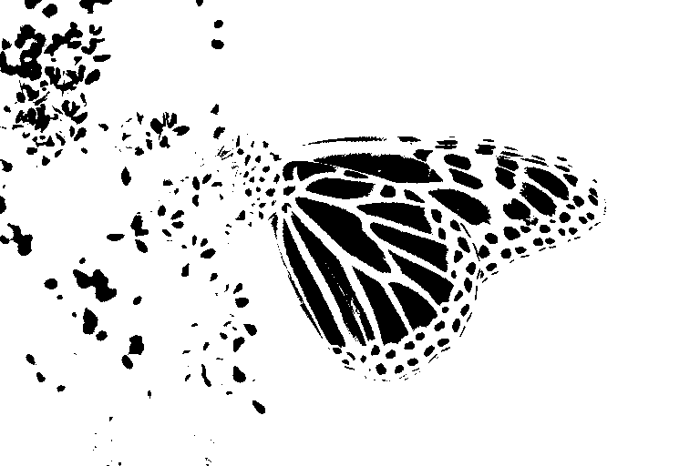

# Export

```@contents
Pages = ["export.md"]
Depth = 2:2
```

**ImageColorThresholderApp** gui makes possible to export progress to workspace and file to do furthur analysis on images. 

## Export as function
After changing interval sliders as per use case, select **Export** button. It exports selection to workspace as function named [`image_color_threshold`](@ref). [`image_color_threshold`](@ref) takes image, background color(optional) as inputs, if background color omitted it takes black as background color, it returns mask and thresholded image.

Without background color
```julia
mask, timg1 = image_color_threshold(img)

timg1
```


With backgound color(magenta)
```julia
mask, timg2 = image_color_threshold(img, RGB(1, 0, 1))

timg2
```


in both cases mask image is same
```julia
Gray.(mask)
```


## Export code to file
Enter valid julia file path in **Julia file path textbox** then press enter, after select Export button. Export button exports selection to workspace and write as julia code in given file path. If julia file not exists at given location it creates automatically, if exists it overwrites file content.

Sample file path

`/home/programs/export.jl`

Sample exported code
```julia
function image_color_threshold(img::Matrix{RGB{T}}, bg=RGB(0.0,0.0,0.0)) where {T}
    mask = map(img) do pix
        _cnd = (0.0 <= getproperty(pix, :r) <= 1.0) && (0.5607843137254902 <= getproperty(pix, :g) <= 1.0) && (0.0 <= getproperty(pix, :b) <= 1.0)
        !(_cnd)
    end
    new_img = deepcopy(img)
    new_img[.!mask] .= bg
    return (mask, new_img)
end
```

## Export as image
As previous mentioned export as function then

```julia
using FileIO

mask, timg = image_color_threshold(img)

# Save thresholded image
save("thresholded_image.png", timg)

# Save mask as image
save("mask.png", Gray.(mask))
```


## Export variables
[JLD2](https://github.com/JuliaIO/JLD2.jl) useful to export `mask` and `thresholed image` to JLD2 file which can be used in different julia sessions.

```julia
using JLD2

mask, timg = image_color_threshold(img, bg)

jldsave("export.jld2"; mask, timg)
```
