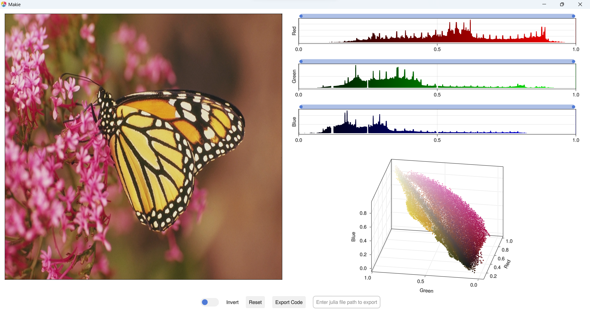

# ImageColorThresholderApp.jl

**ImageColorThresholderApp** is a GUI application powered by [Makie.jl](https://github.com/MakieOrg/Makie.jl), Inspired by MATLAB [Color Thresholder](https://www.mathworks.com/help/images/ref/colorthresholder-app.html) app.

ImageColorThresholderApp is a GUI tool for segmenting color images. By using it threshold individual color channels or combinations of channels in different color spaces, such as RGB, HSV, Lab and YCbCr. This app generates binary segmentation mask and thresholded image for color images.

Here are features of ImageColorThresholderApp:

* Threshold individual color channels or combinations of channels in different color spaces (RGB, HSV, Lab, YCbCr, etc.).
* Adjust the threshold levels interactively.
* Preview the thresholded image in real time.
* Generate julia code to work space as well as external file.
* Generate thresholded images and segmentation masks.

ImageColorThresholderApp needs one of [Makie backend](https://docs.makie.org/dev/explanations/backends/).
* Using GLMakie it opens app window.
* using WGLMakie It integrate with [Pluto.jl](https://github.com/fonsp/Pluto.jl) notebook.

## Installation

You can install ImageColorThresholderApp.jl using Julia's package manager.

For the stable version:

Open a Julia REPL and run the following command:

```julia
] add ImageColorThresholderApp
```

For the development version:

```julia
using Pkg
Pkg.add(url="https://github.com/rakeshksr/ImageColorThresholderApp.jl")
```

## Usage

```julia
using GLMakie
using ImageColorThresholderApp
using TestImages

img = testimage("monarch_color")
image_color_thresholder_app(img)
```


## Supported Image color formats
- RGB
- HSV
- Lab
- YCbCr
