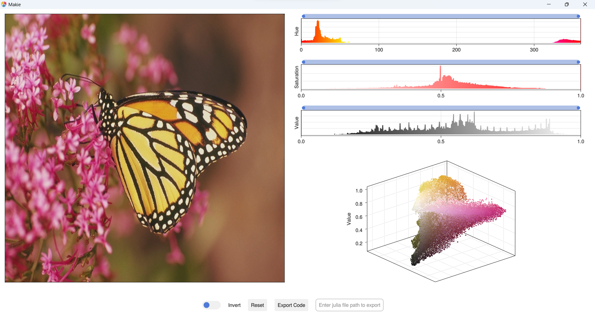

# Usage

**ImageColorThresholderApp** supports following image color spaces

- RGB
- HSV
- Lab
- YCbCr

Each color space image open with thier repsected channels.

```julia
using GLMakie
using ImageColorThresholderApp
using TestImages
using ColorTypes

rgb_img = testimage("monarch_color")
hsv_img = HSV.(rgb_img)
lab_img = Lab.(rgb_img)
ycbcr_img = YCbCr.(rgb_img)
```

```julia
image_color_thresholder_app(rgb_img)
```


```julia
image_color_thresholder_app(hsv_img)
```


```julia
image_color_thresholder_app(lab_img)
```


```julia
image_color_thresholder_app(ycbcr_img)
```


## Pluto.jl

**ImageColorThresholderApp** integrate with [Pluto.jl](https://github.com/fonsp/Pluto.jl) by using `WGLMakie`

